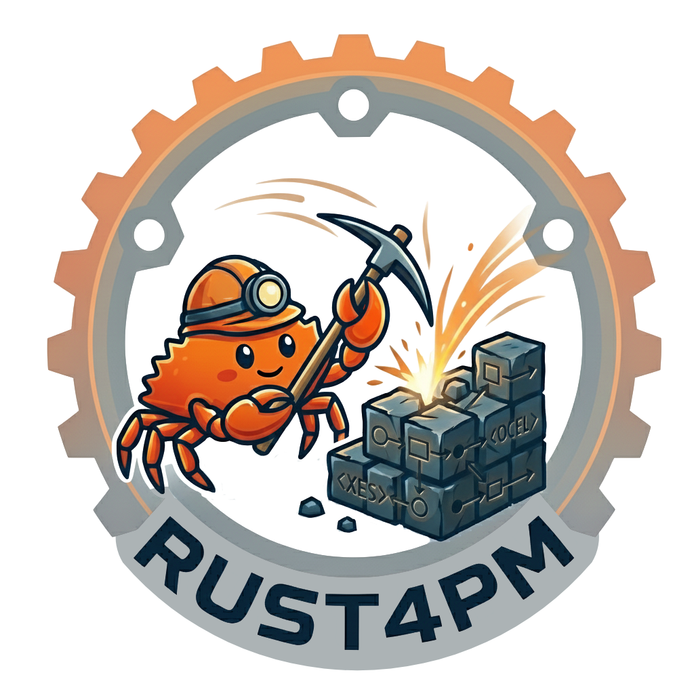

<h1><strong>Rust4PM</strong>: Rust for Process Mining</h1>
  
<strong><code>process_mining</code> Rust Crate</strong>

  

    
    
	
  

## `process_mining`

This crate contains basic data structures, functions and utilities for Process Mining.

Full documentation of the modules, structs and functions of this crate is available at **[docs.rs/process_mining/](https://docs.rs/process_mining/)**.

_As this crate is still in very active development, expect larger API changes also in minor (or even patch) version updates._

### Contributing

#### Test Data

The data (OCEL2, XES, etc. files) used for the tests of this crate are available for download at <https://rwth-aachen.sciebo.de/s/4cvtTU3lLOgtxt1>.
Simply download this zip and extract it into the `test_data` folder.

#### Linting and Formatting

We use automatic CI pipelines for checking lint and formatting rules of the `process_mining` crate.
See the corresponding .yml file for the exact checks.
You can and should test your changes also locally, e.g., using `cargo clippy --all-targets --all-features -- -D warnings`, `cargo fmt --all --check`
and `cargo test --verbose --all-features` inside the `process_mining` folder.
To test integrity of the documentation, use `RUSTDOCFLAGS="-D warnings" cargo doc --all-features --no-deps` (on Windows `PowerShell` you might need to set the `RUSTDOCFLAGS` env variable differently).

To apply compatible lint and formatting rules automatically, run `cargo clippy --all-targets --all-features --fix --allow-staged` and `cargo fmt --all` in the `process_mining` folder.

#### Releasing New Versions
Whenever a new version of the Rust4PM project is released, the following steps have to be completed:
1. Increase the version number
2. Also increase the version numbers of the r4pm CLI bindings, the macro crate, and the Python bindings.
3. Run all tests, check formatting and clippy lints. Also build the documentation.
  - `cargo clippy --all-targets --all-features --fix --allow-staged`
  - `cargo clippy --all-targets --all-features -- -D warnings`
  - `cargo fmt --all --check`
  - `RUSTDOCFLAGS="-D warnings" cargo doc --all-features --no-deps`
4. Publish the new macro crate version (first) and then the new `process_mining` version (second) to crates.io
5. Build the Python bindings and publish the updated version to PyPi
6. Export a updated bindings json file (`cargo test export_bindings --features bindings,dataframes,ocel-sqlite`) and add the new version to the docs ([rust4pm.aarkue.eu](https://rust4pm.aarkue.eu/))

## `r4pm`
CLI automatically generated from functions exposed in the `process_mining` crate.

## LICENSE
This project is licensed under either Apache License Version 2.0 or MIT License at your option.
